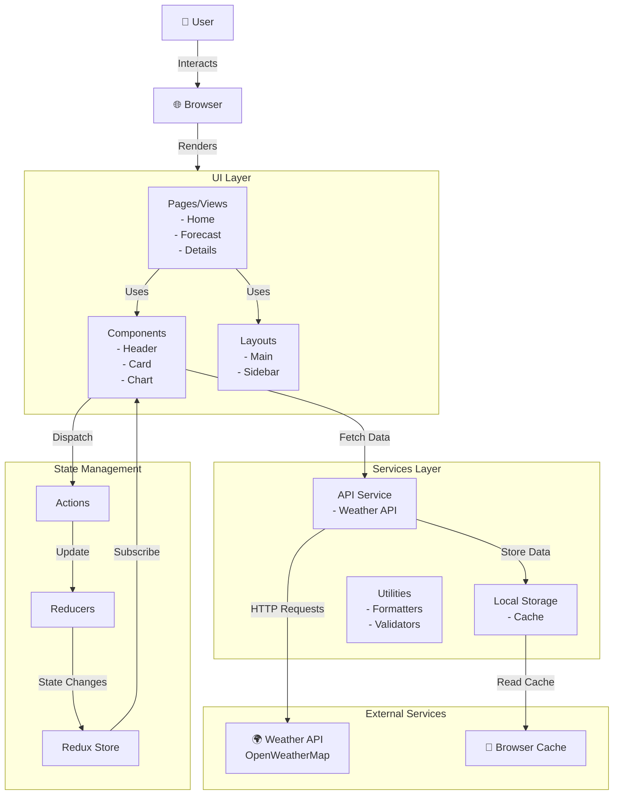

# Frontend Architecture Overview

## Architecture Diagram

## Architecture Layers

### 1. **UI Layer**
- **Pages/Views**: Main application screens (Home, Forecast, Details)
- **Components**: Reusable UI elements (Header, Cards, Charts)
- **Layouts**: Page structure and layout components

### 2. **State Management**
- **Redux Store**: Centralized state container
- **Actions**: Events that describe what happened
- **Reducers**: Pure functions that update state

### 3. **Services Layer**
- **API Service**: Handles all weather API calls
- **Local Storage**: Caches data for offline access
- **Utilities**: Helper functions for formatting and validation

### 4. **External Services**
- **Weather API**: Third-party weather data provider
- **Browser Cache**: Client-side caching mechanism

## Data Flow

1. User interacts with UI components
2. Components dispatch Redux actions
3. Reducers process actions and update state
4. Redux notifies subscribed components
5. Components fetch data via API Service
6. API Service makes HTTP requests to Weather API
7. Data is cached in Local Storage
8. UI components re-render with new data